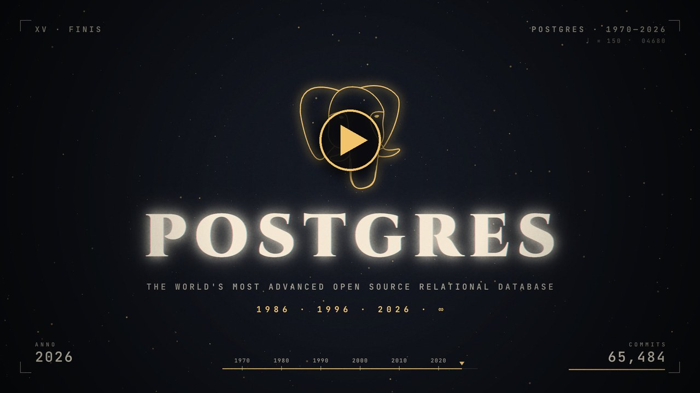

# pgfilm

Procedurally generated short films about Postgres: every frame is drawn by code, the music is synthesized from the same beat grid, and every on-screen claim is verified against primary sources.

| Film | Length | Folder | Watch |
|---|---|---|---|
| Postgres history: 1970 → 2026 | 2:42 | [films/postgres-history](films/postgres-history) | [YouTube](https://youtu.be/WUmvqHlWx_4) · [on X](https://x.com/samokhvalov/status/2103920825581842567) · [on LinkedIn](https://www.linkedin.com/posts/samokhvalov_this-one-is-about-postgres-40-years-1986-ugcPost-7509685236369252353-XYly/) · [download](https://github.com/NikolayS/pgfilm/releases/tag/postgres-history-2026-09-26) |

Each film is self-contained in `films/<name>/` (source, audio, assets, verification ledger, QA notes). Rendered videos are attached to GitHub Releases (they exceed git's file-size limits).

## License

Copyright 2026 Nikolay Samokhvalov and contributors.

Licensed under the [Apache License 2.0](LICENSE). This covers the project's original source code, documentation, and generated film and audio content. Third-party assets and dependencies retain their own licenses; see each film's README for asset credits.
